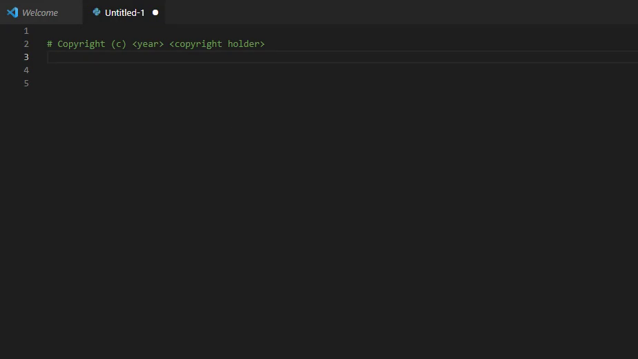

This extension provides quick snippets for SPDX License headers.

Inpired by [License Snippets for VSCODE](https://marketplace.visualstudio.com/items?itemName=issammani.license-snippets)

## Features

  * Insert the header by typing `SPDX-[license]`, such as `SPDX-GPL-3.0-or-later`, `SPDX-WTFPL` or  `SPDX-MPL-2.0`

## Licenses
  * You can find a list of supported licenses at https://spdx.org/licenses/